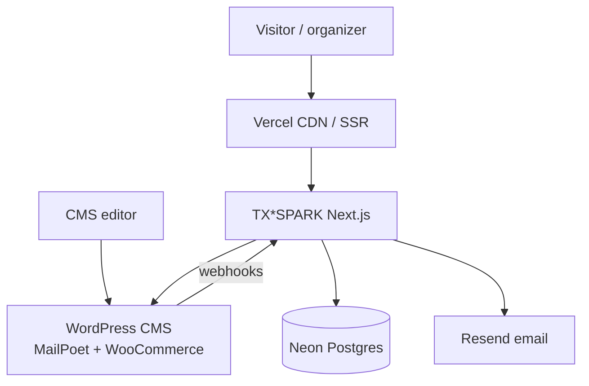
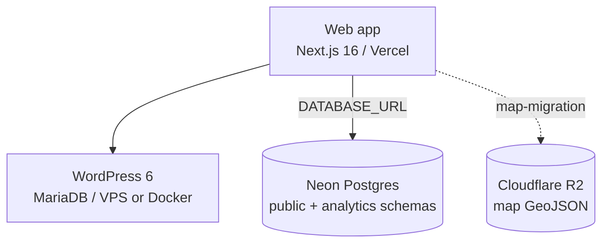
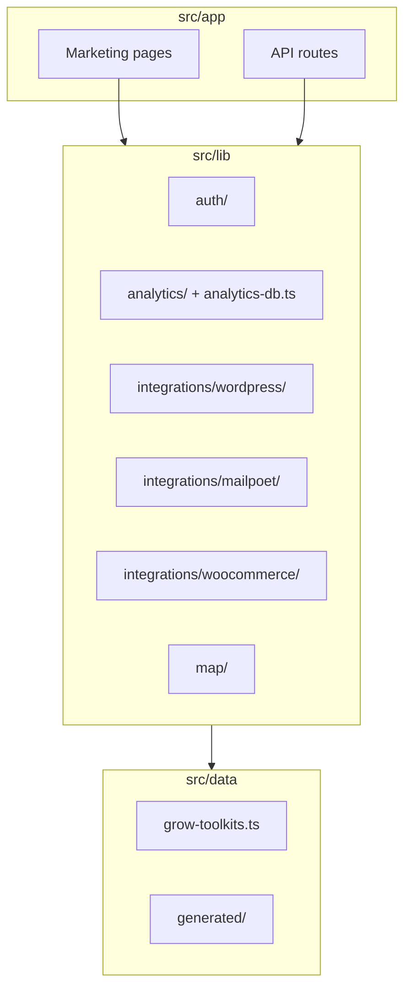
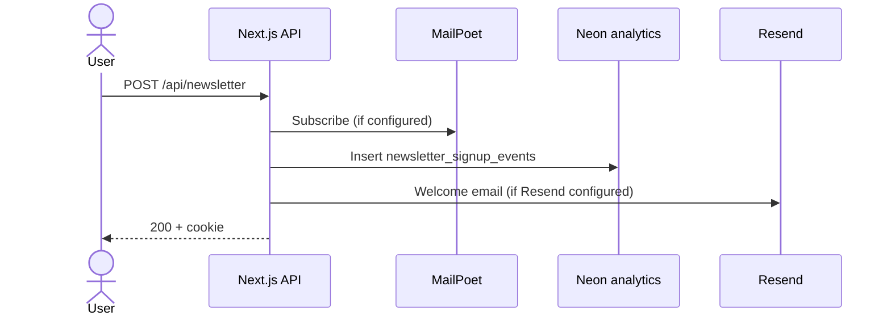
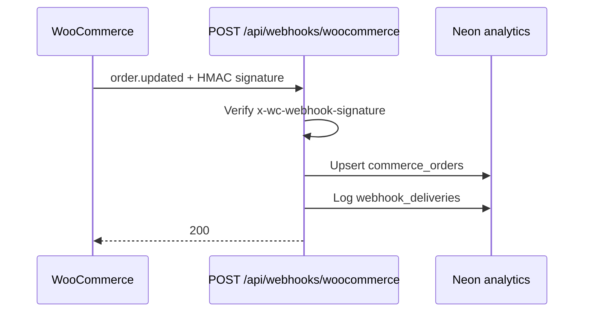
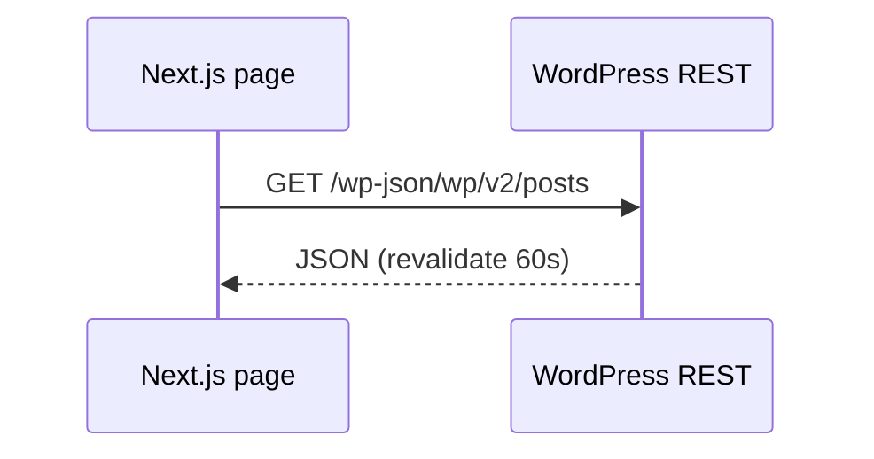

# Architecture — TX*SPARK

> **Audience:** new contributors and contractors. Read this first.
> **Maintenance:** update when containers, integrations, or major flows change.

## What this system does

TX*SPARK is a **Next.js** public site for grassroots civic organizing in
Texas. It serves marketing pages, GROW toolkits, newsletter signup, and
API routes that connect to **headless WordPress** (content, MailPoet,
WooCommerce) and an **analytics** Postgres schema on **Neon**. A separate
**map migration** worktree (`map-migration/`) holds the district/household
map stack (Mapbox, PostGIS, ETL) until it is merged into this repo.

## 1. Context

Visitors and organizers use the web app. Editors manage content in
WordPress. Commerce and newsletter events flow into Neon for reporting.
The map product (when enabled) uses its own Postgres branch and static
GeoJSON on R2.

## 2. Containers

| Container | Tech | Deploy | Key env vars |
| --- | --- | --- | --- |
| Web app | Next.js 16, React 19, Tailwind 4 | Vercel | `DATABASE_URL`, `WORDPRESS_API_URL`, `MAILPOET_*`, `WOOCOMMERCE_*`, `RESEND_API_KEY` |
| CMS | WordPress + MariaDB | Local: `wordpress/docker-compose.yml`; prod: `infra/hosting/` | (CMS host secrets) |
| Postgres | Neon — `public` (core/map) + `analytics` schema | Neon | `DATABASE_URL` |
| Map stack (WIP) | Next + Prisma/PostGIS + Mapbox | `map-migration/` | `DATABASE_URL`, Mapbox tokens, R2 keys |

## 3. Components — web app (`src/`)

| Module | Responsibility |
| --- | --- |
| `app/` | Routes only — keep handlers thin |
| `components/` | Layout, nav, newsletter, map UI shell |
| `lib/integrations/wordpress/` | Headless REST client |
| `lib/integrations/mailpoet/` | Newsletter list sync |
| `lib/integrations/woocommerce/` | REST client + webhook mapping |
| `lib/analytics/` | Record signups, orders, webhook deliveries |
| `lib/auth/` | Magic-link session (map flows; partial in main app) |
| `lib/map/` | Map helpers still referenced from main tree |
| `data/` | Toolkits, legislator rosters, layer config |

**Layer rules:** `app/*` may import `components/`, `lib/`, `data/`, `hooks/`.
`lib/*` must not import `components/` or `app/*`. See
`standards/99-project-overrides.md`.

## 4. Key sequences

### 4.1 Newsletter signup

### 4.2 WooCommerce order webhook

### 4.3 Headless content fetch (future / partial)

Client: `src/lib/integrations/wordpress/client.ts`.

## 5. Where do I look when…

| Symptom | Likely module | Likely file |
| --- | --- | --- |
| Newsletter fails | MailPoet config | `lib/integrations/mailpoet/config.ts` |
| No analytics rows | DB URL unset | `lib/analytics-db.ts`, `env/analytics.example` |
| Webhook 401 | Secret mismatch | `app/api/webhooks/woocommerce/route.ts` |
| WP fetch errors | CMS URL / auth | `lib/integrations/wordpress/config.ts` |
| Nav / toolkit links wrong | Nav data | `components/nav-config.ts`, `data/grow-toolkits.ts` |
| Map behavior | Map migration tree | `map-migration/src/components/map/` |

## 6. Cross-cutting concerns

- **Auth:** Magic-link tokens and session cookies under `lib/auth/` (used
  heavily in map flows; marketing site login is not fully wired in nav).
- **Secrets:** Templates in `env/`; never commit `.env` or `.env.local`.
- **Email:** Resend for newsletter welcome; react-email templates in
  `src/emails/`.
- **Testing:** Vitest — co-located `*.test.ts` under `src/`.
- **Analytics:** Optional — all recorders no-op when `DATABASE_URL`
  is unset.
- **Privacy:** No PII in logs; webhook payloads stored in `analytics` schema
  for debugging/replay — treat DB access as sensitive.

## 7. Related documents

- [`docs/onboarding.md`](onboarding.md) — local setup walkthrough
- [`db/README.md`](../db/README.md) — analytics migrations
- [`docs/adr/`](adr/) — architectural decisions
- [`infra/hosting/README.md`](../infra/hosting/README.md) — CMS hosting
- [`map-migration/docs/map-mode-matrix.md`](../map-migration/docs/map-mode-matrix.md) — map UX matrix (WIP tree)
- [`standards/99-project-overrides.md`](../standards/99-project-overrides.md) — repo layout overrides

## Open questions / known gaps

- **Map merge:** `map-migration/` duplicates much of `src/` map code; target
  architecture (single app vs split service) is undecided — see ADR 0004.
- **Core user linking:** email match against `public."User"` on the same
  `DATABASE_URL` for `core_user_id` on analytics events.
- **OpenAPI:** Public API routes are few; no committed `openapi.yaml` yet.
