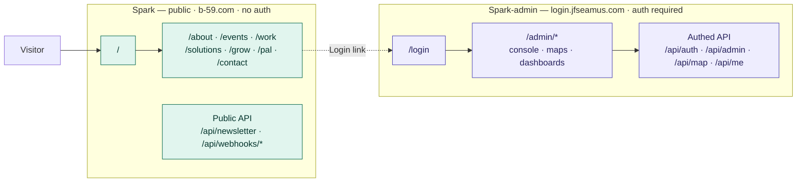

# Sitemap — Spark + Spark-admin

> **Audience:** contributors, contractors, and content/SEO work.
> **Maintenance:** update when routes are added or removed, or when the
> public ↔ authenticated boundary moves.

Two separate Next.js deployments on two domains. **Spark** is the public,
crawlable marketing site. **Spark-admin** is the authenticated organizer /
admin app. They share no routes — the only seam between them is the header
**"Login"** link, which crosses domains into the admin app.

## The boundary at a glance

The crossing (`-.->|Login link|`) is the entire interface between the two
apps from the user's side. It is configured in
[`Header.tsx`](../src/components/Header.tsx) via `NEXT_PUBLIC_LOGIN_URL`
(default `https://login.jfseamus.com`). Server-side, the apps also touch
through integrations (WordPress / MailPoet / WooCommerce on Spark; the
`/api/seamus/[...path]` proxy on Spark-admin), but those are not routes a
user navigates.

---

## Spark — public marketing site

`b-59.com` · unauthenticated · indexed (`sitemap.ts` + `robots.ts`)

### Pages

- `/` — Home
- `/events` — Events
- `/work` — Our work
- `/contact` — Contact
- `/about` — About
  - `/about/mission` — Mission
  - `/about/people` — People
  - `/about/partners` — Partners
  - `/about/data` — Data
  - `/about/privacy` — Privacy policy
  - `/about/terms` — Terms of use
  - `/about/sitemap` — Sitemap (human-facing page)
- `/solutions` — Solutions
  - `/solutions/pal` — PAL  (also `/pal`)
  - `/solutions/grow` — GROW  (also `/grow`)
- `/grow` — GROW hub
  - `/grow/[toolkit]` — Toolkit detail. Six slugs: `gtkyp`, `gotvol`,
    `gtkyv`, `gotvr`, `gotv`, `tysm` (see
    [`grow-toolkits.ts`](../src/data/grow-toolkits.ts)).

### Public API + generated

| Route | Purpose |
| --- | --- |
| `/api/newsletter` · `/api/newsletter/status` | MailPoet signup + status |
| `/api/webhooks/woocommerce` | WooCommerce order webhook → Neon analytics |
| `sitemap.ts` · `robots.ts` | Generated SEO metadata (17 public URLs) |

---

## Spark-admin — authenticated app

`login.jfseamus.com` · session required · **not indexed** (`sitemap.ts` is a
stub by design)

Access is gated by a session cookie in middleware. `/admin/users` and
`/admin/platform` are further restricted to platform admins
(`useIsPlatformAdmin()`).

### Entry — where Spark's "Login" lands

- `/login` — Login  →  `/login/reset` — Password reset
- `/` — redirects to `/admin`

### Admin console — `/admin` (sidebar nav)

- `/admin` — My precinct (dashboard)
- `/admin/trends` — Trends
- `/admin/voter-insights` — Voter insights
- `/admin/resources` — Resources
- `/admin/settings` — Settings
- `/admin/profile` — Profile
- Additional dashboards: `/admin/access`, `/admin/geography`,
  `/admin/insights`, `/admin/org-scope`, `/admin/performance`,
  `/admin/progress`
- **Platform-admin only:** `/admin/users`, `/admin/users/[id]`,
  `/admin/platform`

### Maps

- In-console: `/admin/map`, `/admin/map/spark`, `/admin/map/district`,
  `/admin/map/report`
- Standalone: `/map`, `/map/spark`, `/map/district`

### Authenticated API

| Group | Routes |
| --- | --- |
| `/api/auth/*` | `login`, `logout`, `bootstrap`, `session`, `magic-link/{request,verify}`, `password-reset/{request,complete}` |
| `/api/admin/*` | users, organizations, geography, cockpit, dashboard, performance, progress, resources, stats, voter-insights, org-scope, auth-roles |
| `/api/me/*` | `profile`, `password`, `organizations`, `access-diagnostic` |
| `/api/map/*` | `boundaries`, `boundary-layers`, `precinct-layer`, `external-layer`, `households` |
| `/api/mapbox/*` | `geocoding`, `reverse-geocoding`, `directions` |
| `/api/seamus/[...path]` | Catch-all proxy |
| `/api/docs` · `/api/openapi.json` | API documentation |
</content>
</invoke>
